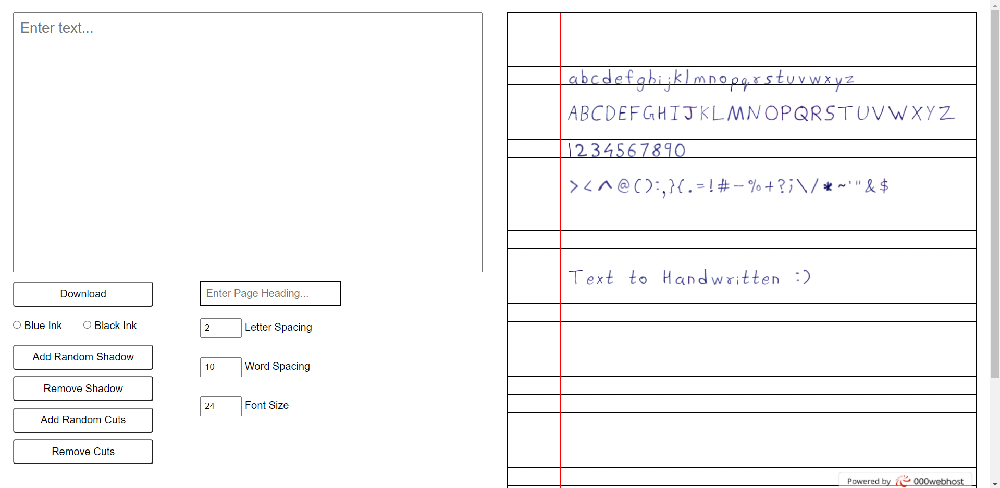
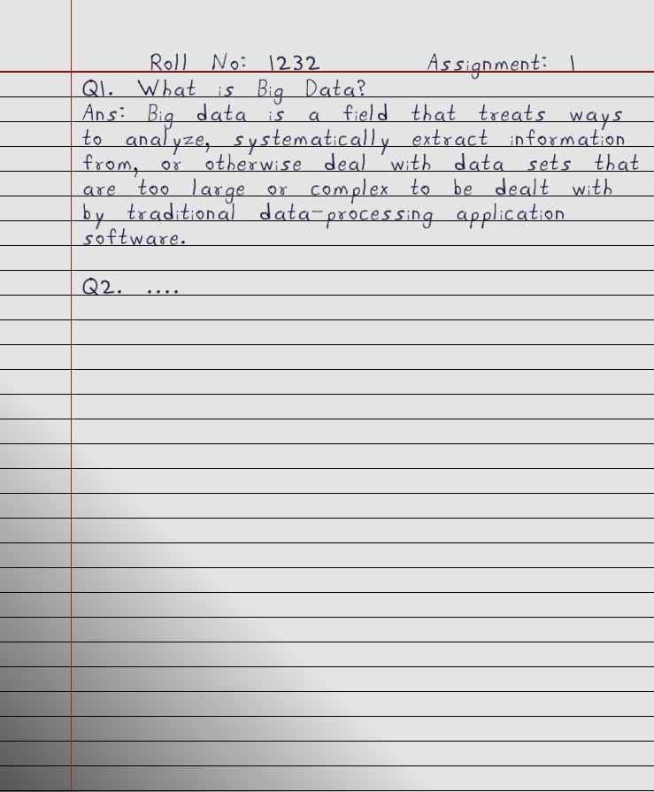
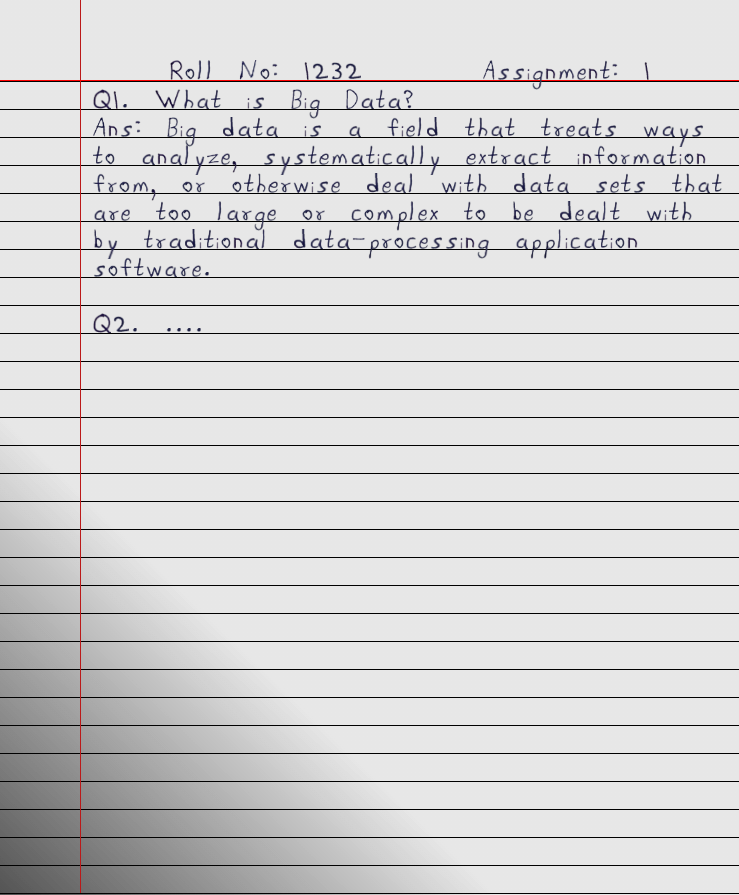

# Hand-Written

A simple web application to convert text into my own handwriting. I hate writing, so I made this to complete my engineering assignments :D
Basic features such as letter spacing, word spacing and font size are added along with additional features such as adding page shadow, page heading and random cancellations are present to make the output look more realistic.

## Live Demo - https://goruto.000webhostapp.com/websites/Text%20to%20Handwritten/

## Output Example Screenshot -

## Video Example - 

https://user-images.githubusercontent.com/53529178/120641444-37c6a780-c491-11eb-9d03-98d188878e2e.mp4
